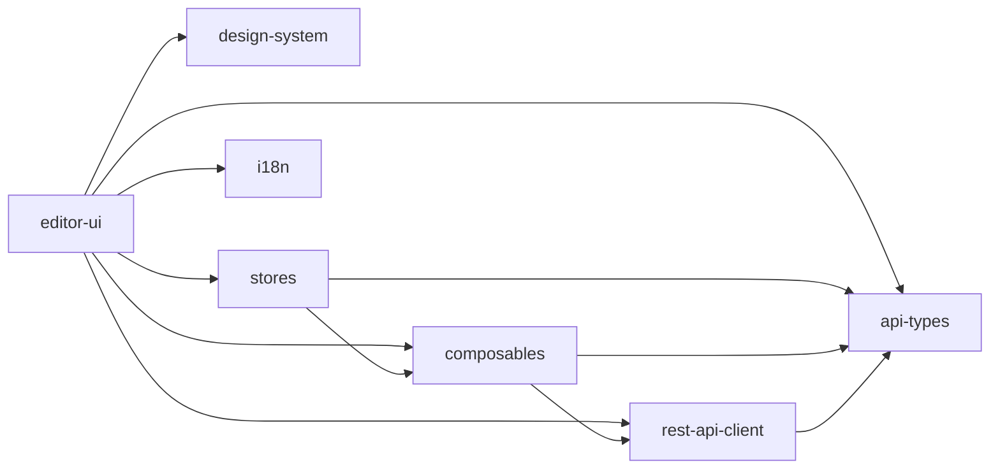

# 패키지 의존성 분석

n8n 모노레포는 복잡한 패키지 의존성 구조를 가지고 있습니다. 각 패키지의 역할과 의존 관계를 이해하는 것은 코드베이스를 파악하는 데 중요합니다.

## 의존성 그래프

### 1. 코어 의존성

```mermaid
graph TB
    subgraph "Core Layer"
        A[workflow] --> B[@n8n/types]
        C[core] --> A
        C --> D[@n8n/errors]
        C --> E[@n8n/utils]
        C --> F[@n8n/di]
    end

    subgraph "Backend Layer"
        G[cli] --> C
        G --> H[nodes-base]
        G --> I[@n8n/api-types]
        G --> J[@n8n/config]
        G --> K[@n8n/db]
    end

    subgraph "Frontend Layer"
        L[editor-ui] --> I
        L --> M[@n8n/design-system]
        L --> N[@n8n/stores]
        L --> O[@n8n/i18n]
        L --> P[@n8n/composables]
    end

    subgraph "Node Layer"
        H --> I
        H --> A
        Q[nodes-langchain] --> H
        Q --> I
    end
```

### 2. 프론트엔드 내부 의존성



## 주요 패키지 의존성 상세

### @n8n/api-types
모든 패키지에서 참조하는 핵심 타입 정의 패키지입니다.

**의존받는 패키지:**
- cli
- editor-ui
- nodes-base
- nodes-langchain
- stores
- rest-api-client
- 등 거의 모든 패키지

**주요 내용:**
```typescript
// 워크플로우 관련 타입
export interface IWorkflow {
  id: string;
  name: string;
  nodes: INode[];
  connections: IConnections;
  active: boolean;
  settings: IWorkflowSettings;
}

// 노드 관련 타입
export interface INode {
  id: string;
  name: string;
  type: string;
  typeVersion: number;
  position: [number, number];
  parameters: IDataObject;
  webhookId?: string;
}
```

### core
워크플로우 실행 엔진으로, 다른 패키지에 대한 의존성이 최소화되어 있습니다.

**직접 의존성:**
- workflow (워크플로우 타입)
- @n8n/errors (에러 처리)
- @n8n/utils (유틸리티)
- @n8n/di (의존성 주입)

### cli
백엔드 서버로, 대부분의 핵심 패키지에 의존합니다.

**주요 의존성:**
```json
{
  "dependencies": {
    "@n8n/api-types": "workspace:*",
    "@n8n/config": "workspace:*",
    "@n8n/core": "workspace:*",
    "@n8n/db": "workspace:*",
    "@n8n/nodes-base": "workspace:*",
    "express": "^4.18.2",
    "typeorm": "@n8n/typeorm"
  }
}
```

### editor-ui
Vue 3 기반 프론트엔드 애플리케이션입니다.

**주요 의존성:**
```json
{
  "dependencies": {
    "@n8n/api-types": "workspace:*",
    "@n8n/design-system": "workspace:*",
    "@n8n/stores": "workspace:*",
    "@n8n/i18n": "workspace:*",
    "@n8n/composables": "workspace:*",
    "vue": "^3.5.13",
    "pinia": "^2.2.4",
    "vue-router": "^4.5.0"
  }
}
```

## 의존성 관리 정책

### 1. 버전 고정 (Catalog)
pnpm workspace catalog를 사용하여 공통 의존성 버전을 관리합니다.

```yaml
# pnpm-workspace.yaml
catalog:
  typescript: 5.9.2
  '@types/node': '^20.17.50'
  express: '^4.18.2'
  vue: '^3.5.13'
  pinia: '^2.2.4'
```

### 2. 내부 패키지 참조
workspace 프로토콜을 사용하여 내부 패키지를 참조합니다.

```json
{
  "@n8n/api-types": "workspace:*",
  "@n8n/design-system": "workspace:*",
  "@n8n/stores": "workspace:*"
}
```

### 3. 순환 의존성 방지
엄격한 레이어 구조를 통해 순환 의존성을 방지합니다.

- Core 패키지는 다른 패키지에 의존하지 않음
- Frontend 패키지는 Backend 패키지에 직접 의존하지 않음
- Node 패키지는 Core에만 의존

## 빌드 의존성 순서

Turbo를 사용한 빌드 의존성 정의:

```json
{
  "pipeline": {
    "build": {
      "dependsOn": ["^build"],
      "outputs": ["dist/**"]
    }
  }
}
```

**실제 빌드 순서:**
1. @n8n/types, @n8n/constants (기본 타입)
2. @n8n/utils, @n8n/errors (기본 유틸리티)
3. @n8n/api-types, workflow (비즈니스 타입)
4. @n8n/di, @n8n/config (인프라)
5. core (워크플로우 엔진)
6. nodes-base, @n8n/design-system (기능 구현체)
7. cli, editor-ui (애플리케이션)

## 런타임 의존성

### 1. Backend 런타임
```
CLI Process
├── Express Server
├── Workflow Engine (core)
├── Node Executor
├── Database (TypeORM)
└── Queue (Bull)
```

### 2. Frontend 런타임
```
Vue Application
├── Router (vue-router)
├── State Management (Pinia stores)
├── UI Components (@n8n/design-system)
├── API Client (@n8n/rest-api-client)
└── i18n (@n8n/i18n)
```

## 의존성 최적화

### 1. 트리 쉐이킹
ESM 모듈을 사용하여 사용되지 않는 코드를 제거합니다.

### 2. 다이나믹 임포트
필요할 때만 모듈을 로드합니다:

```typescript
// 에디터 컴포넌트
const NodeEditor = defineAsyncComponent(() =>
  import('./NodeEditor.vue')
);
```

### 3. 공통 번들 분리
vendor 라이브러리를 별도 번들로 분리하여 캐싱 효율을 높입니다.

## 의존성 업데이트 전략

### 1. 자동화된 업데이트
- Renovate Bot을 사용한 자동 PR 생성
- semantic-release를 사용한 버전 관리

### 2. 안전한 업데이트 절차
1. 브랜치 분리
2. 의존성 업데이트
3. 전체 테스트 실행
4. 특정 패키지 빌드 테스트
5. 통합 테스트
6. PR 생성 및 코드 리뷰

### 3. 호환성 검사
- 타입 호환성 확인 (`pnpm typecheck`)
- 런타임 테스트 (`pnpm test`)
- E2E 테스트 (`pnpm test:e2e`)

## 주의사항

### 1. 의존성 추가 시
- 해당 패키지가 정말 필요한지 확인
- 기존 패키지로 구현 가능한지 검토
- 번들 크기에 미치는 영향 고려

### 2. 버전 충돌
- peerDependencies 설정으로 충돌 방지
- resolutions로 특정 버전 강제 지정

### 3. 보안 업데이트
- 취약점 스캐너를 통한 주기적 확인
- 긴급 패치는 즉시 적용