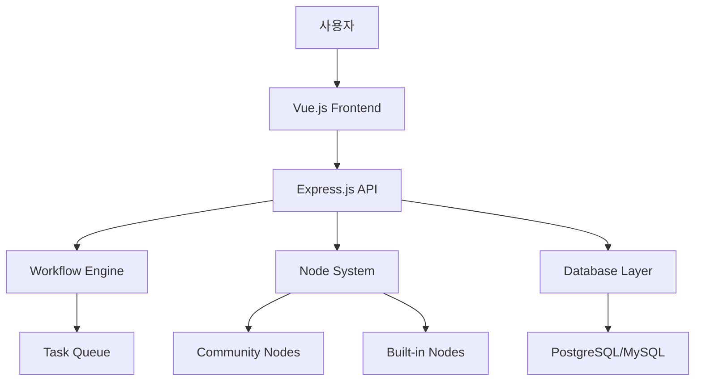

# n8n 프로젝트 개요

## n8n이란?

n8n은 워크플로우 자동화 플랫폼으로, 다양한 서비스와 애플리케이션을 연결하여 비즈니스 프로세스를 자동화할 수 있는 도구입니다. 노드 기반의 시각적 인터페이스를 통해 복잡한 워크플로우를 쉽게 구축하고 관리할 수 있습니다.

## 핵심 특징

### 1. 시각적 워크플로우 빌더
- 드래그 앤 드롭 인터페이스
- 노드 기반 워크플로우 설계
- 실시간 미리보기 및 디버깅

### 2. 방대한 통합 지원
- 400+ 빌트인 노드
- 커뮤니티 노드 생태계
- REST API, 웹훅 지원

### 3. 유연한 배포 옵션
- 셀프 호스팅
- 클라우드 버전
- 도커 지원

### 4. 확장성
- 커스텀 노드 개발
- 플러그인 아키텍처
- API 확장

## 기술 스택

### 프론트엔드
- **Vue 3** - 최신 프론트엔드 프레임워크
- **TypeScript** - 타입 안전성
- **Vite** - 빠른 빌드 도구
- **Pinia** - 상태 관리
- **Element Plus** - UI 컴포넌트 라이브러리

### 백엔드
- **Node.js** - 서버 사이드 자바스크립트
- **TypeScript** - 타입 안전성
- **Express.js** - 웹 프레임워크
- **TypeORM** - ORM 라이브러리
- **Bull Queue** - 작업 큐 관리

### 데이터베이스
- **PostgreSQL** - 주요 데이터베이스
- **MySQL** - 지원 데이터베이스
- **SQLite** - 개발 환경

### 개발 도구
- **pnpm** - 패키지 매니저
- **Turbo** - 모노레포 빌드 시스템
- **Jest** - 테스트 프레임워크
- **Playwright** - E2E 테스트

## 아키텍처 원칙

### 1. 모듈성
 각 기능은 독립적인 모듈로 설계되어 유지보수가 용이합니다.

### 2. 확장성
 플러그인 기반 아키텍처로 새로운 기능을 쉽게 추가할 수 있습니다.

### 3. 타입 안전성
 전체 프로젝트에서 TypeScript를 사용하여 런타임 에러를 최소화합니다.

### 4. 테스트 가능성
 높은 테스트 커버리지를 목표로 안정적인 코드를 유지합니다.

## 프로젝트 구조

## 핵심 컴포넌트

### 1. Frontend (`packages/editor-ui`)
사용자 인터페이스와 상호작용을 담당합니다. Vue 3 기반의 SPA로 실시간 워크플로우 편집 기능을 제공합니다.

### 2. Backend (`packages/cli`)
REST API 서버와 CLI 도구를 포함합니다. 워크플로우 실행, 사용자 관리, 인증 등 주요 비즈니스 로직을 처리합니다.

### 3. Workflow Engine (`packages/core`)
워크플로우 실행의 핵심 로직을 담당합니다. 노드 간 데이터 흐름, 조건부 분기, 루프 등을 처리합니다.

### 4. Node System (`packages/nodes-base`)
개별 노드들의 구현체입니다. 각 노드는 특정 서비스나 기능과의 통합을 담당합니다.

### 5. Shared Types (`packages/@n8n/api-types`)
프론트엔드와 백엔드 간의 타입 정의를 공유하여 일관성을 유지합니다.

## 실행 흐름

1. **워크플로우 생성**: 사용자가 프론트엔드에서 시각적으로 워크플로우를 설계
2. **워크플로우 저장**: 설계된 워크플로우가 JSON 형태로 데이터베이스에 저장
3. **워크플로우 실행**: 트리거(수동/자동)에 의해 워크플로우 실행 시작
4. **노드 처리**: 워크플로우 엔진이 각 노드를 순서대로 실행
5. **결과 처리**: 실행 결과가 데이터베이스에 저장되거나 외부 서비스로 전송

## 확장 방법

### 커스텀 노드 개발
1. `@n8n/create-node`를 이해해 노드 스켈레톤 생성
2. 노드의 동작 구현
3. 테스트 코드 작성
4. 커뮤니티에 공유

### API 확장
1. 새로운 엔드포인트 정의
2. 컨트롤러 구현
3. 서비스 로직 작성
4. API 타입 정의

### 프론트엔드 확장
1. 새로운 컴포넌트 개발
2. 라우트 추가
3. 상태 관리 연동
4. i18n 번역 추가