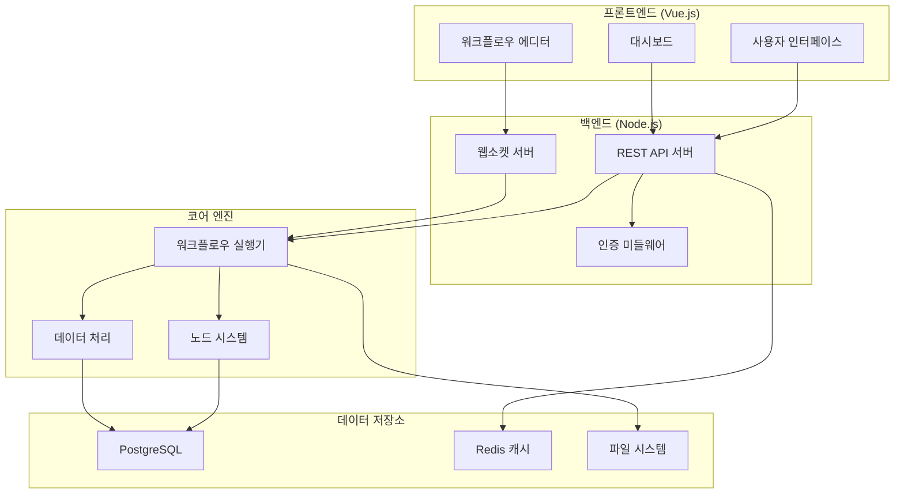
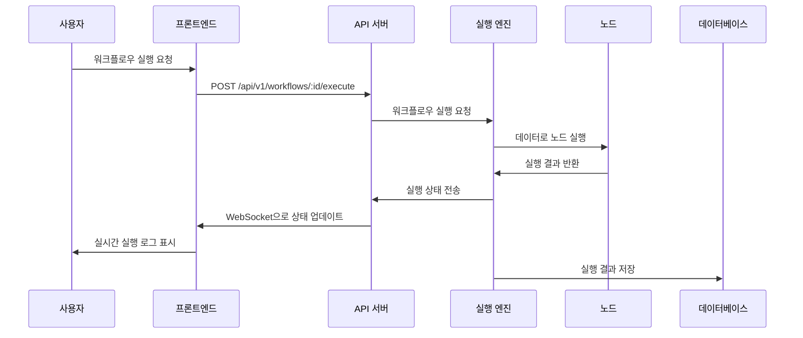

# n8n 아키텍처 개요

n8n은 워크플로우 자동화 플랫폼으로, 현대적인 기술 스택을 기반으로 구축된 오픈소스 프로젝트입니다. 이 문서는 n8n의 전체 아키텍처를 한국어로 소개합니다.

## 프로젝트 개요

### n8n이란?
- **목표**: 누구나 쉽게 워크플로우를 만들 수 있는 자동화 플랫폼
- **특징**: 시각적 인터페이스, 400+ 통합, 셀프 호스팅 가능
- **라이선스**: Fair Code (특정 조건에서 무료, 그 외 유료)

### 핵심 기능
1. **시각적 워크플로우 빌더**: 드래그 앤 드롭으로 워크플로우 구성
2. **방대한 통합**: API, 웹훅, 데이터베이스 등 다양한 서비스 연결
3. **확장성**: 커스텀 노드와 플러그인 개발
4. **유연한 배포**: 클라우드, 로컬, 도커 등 다양한 환경

## 기술 스택

### 프론트엔드
| 기술 | 용도 | 버전 |
|------|------|------|
| Vue 3 | UI 프레임워크 | ^3.5.13 |
| TypeScript | 타입 안전성 | 5.9.2 |
| Vite | 빌드 도구 | latest |
| Pinia | 상태 관리 | ^2.2.4 |
| Element Plus | UI 컴포넌트 | 2.4.3 |

### 백엔드
| 기술 | 용도 | 버전 |
|------|------|------|
| Node.js | 서버 런타임 | >=22.16 |
| Express.js | 웹 프레임워크 | ^4.18.2 |
| TypeScript | 프로그래밍 언어 | 5.9.2 |
| TypeORM | ORM 라이브러리 | 0.3.20-15 |
| Bull Queue | 작업 큐 | 4.16.4 |

### 데이터베이스
- **PostgreSQL**: 프로덕션 환경
- **MySQL**: 대안
- **SQLite**: 개발 환경

## 전체 아키텍처



## 모노레포 구조

n8n은 pnpm workspaces를 사용하는 모노레포로 관리됩니다:

```
n8n/
├── packages/
│   ├── cli/                # 백엔드 서버
│   ├── core/               # 워크플로우 엔진
│   ├── editor-ui/          # 프론트엔드 앱
│   ├── nodes-base/         # 빌트인 노드들
│   └── @n8n/              # 공유 패키지들
│       ├── api-types/      # 타입 정의
│       ├── design-system/  # UI 디자인 시스템
│       ├── i18n/          # 다국어
│       └── stores/        # 상태 관리
├── scripts/               # 빌드/배포 스크립트
└── docs/                  # 문서
```

## 핵심 컴포넌트

### 1. 워크플로우 실행 엔진
- **위치**: `packages/core/src/execution-engine`
- **역할**: 워크플로우의 로직 실행
- **기능**:
  - 노드 순서 결정
  - 데이터 흐름 관리
  - 에러 처리 및 재시도
  - 동시성 제어

### 2. 노드 시스템
- **위치**: `packages/nodes-base`
- **역할**: 개별 서비스 통합
- **종류**:
  - HTTP 요청 노드
  - 데이터베이스 노드
  - 트리거 노드
  - 데이터 변환 노드

### 3. API 서버
- **위치**: `packages/cli/src`
- **역할**: REST API 및 웹훅 처리
- **주요 기능**:
  - 인증 및 권한 관리
  - 워크플로우 CRUD
  - 실행 모니터링
  - 사용자 관리

### 4. 프론트엔드 앱
- **위치**: `packages/frontend/editor-ui`
- **역할**: 사용자 인터페이스
- **주요 기능**:
  - 시각적 워크플로우 편집기
  - 실행 로그 뷰어
  - 설정 관리
  - 사용자 대시보드

## 데이터 흐름

### 1. 워크플로우 생성
1. 사용자가 프론트엔드에서 노드를 배치
2. 연결线和 설정을 통해 워크플로우 설계
3. JSON 형태로 워크플로우 정의
4. API를 통해 데이터베이스에 저장

### 2. 워크플로우 실행
1. 트리거 (수동/자동) 실행
2. 워크플로우 엔진이 노드 순서 계산
3. 각 노드를 순서대로 실행
4. 데이터를 노드 간 전달
5. 결과 저장 또는 외부로 전송

### 3. 데이터 처리 흐름


## 보안 아키텍처

### 1. 인증 시스템
- **기본 인증**: 이메일/비밀번호
- **OAuth2**: Google, GitHub 등 소셜 로그인
- **SAML**: Enterprise SSO
- **API 키**: 외부 인터페이스

### 2. 권한 관리 (RBAC)
- **역할**: 소유자, 편집자, 뷰어
- **권한**: 워크플로우 접근, 실행, 설정
- **범위**: 개인, 공유, 팀

### 3. 데이터 보안
- **암호화**: 인증 정보, 민감 데이터
- **격리**: 사용자별 데이터 분리
- **감사**: 모든 액션 기록

## 확장성 설계

### 1. 수평 확장
- **워커 프로세스**: 여러 프로세스로 실행 분산
- **메시지 큐**: 비동기 작업 처리
- **로드 밸런싱**: API 서버 분산

### 2. 기능 확장
- **커뮤니티 노드**: 외부 개발자 노드 추가
- **플러그인 시스템**: 핵심 기능 확장
- **후킹**: 이벤트 기반 확장

### 3. 데이터 확장
- **파티셔닝**: 대용량 데이터 분할
- **큐버네티스**: 컨테이너 오케스트레이션
- **CDN**: 정적 자원 배포

## 모니터링 및 로깅

### 1. 메트릭 수집
- **성능**: 응답 시간, 처리량
- **에러**: 실패율, 에러 타입
- **리소스**: CPU, 메모리, 디스크

### 2. 로그 시스템
- **구조화된 로그**: JSON 형식
- **레벨별 로깅**: debug, info, warn, error
- **중앙화 로깅**: ELK Stack 또는 유사

### 3. 헬스 체크
- **데이터베이스**: 연결 상태
- **외부 API**: 가용성 확인
- **시스템**: 디스크 공간, 메모리

## 성능 최적화

### 1. 프론트엔드
- **코드 분할**: 라우트별 로딩
- **지연 로딩**: 필요한 컴포넌트만 로드
- **가상 스크롤**: 대량 데이터 처리

### 2. 백엔드
- **쿼리 최적화**: 인덱스 활용
- **캐싱**: Redis 활용
- **커넥션 풀**: 데이터베이스 연결 재사용

### 3. 실행 엔진
- **병렬 처리**: 독립 노드 동시 실행
- **메모리 관리**: 가비지 컬렉션 최적화
- **배치 처리**: 대량 데이터 묶음 처리

## 주요 설계 원칙

### 1. 모듈성
- 각 컴포넌트는 독립적으로 동작 가능
- 명확한 인터페이스 정의
- 최소 의존성 원칙

### 2. 확장성
- 플러그인 아키텍처
- 개방/폐쇄 원칙 (OCP)
- 이벤트 기반 통신

### 3. 신뢰성
- 실패 격리
- 자동 복구
- 이중화

### 4. 개발자 경험
- 타입 안전성
- 자동화된 테스트
- 풍부한 문서

## 앞으로의 방향

### 1. 아키텍처 진화
- 마이크로서비스로의 점진적 전환
- 클라우드 네이티브 기능 강화
- AI/ML 기능 통합

### 2. 개선 과제
- 성능 최적화
- 보안 강화
- 커뮤니티 참여 확대

### 3. 기술 트렌드
- 서버리스 아키텍처
- 엣지 컴퓨팅
- 실시간 협업

n8n의 아키텍처는 계속 발전하고 있으며, 커뮤니티의 기여를 통해 더욱 발전할 것입니다.