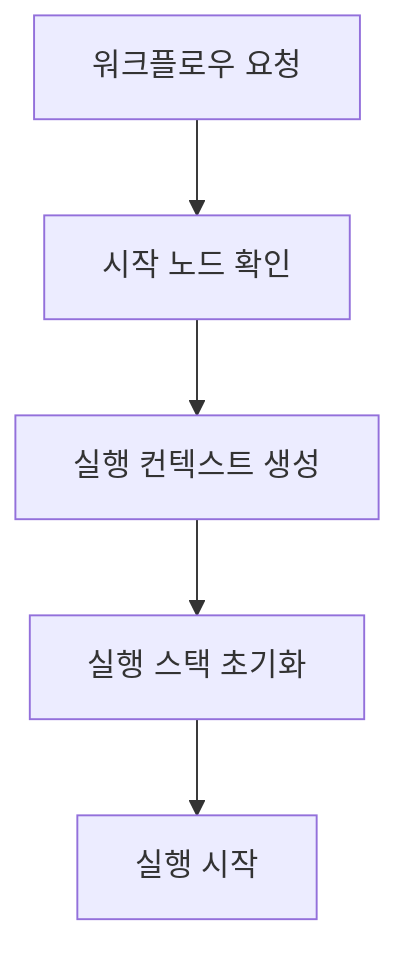
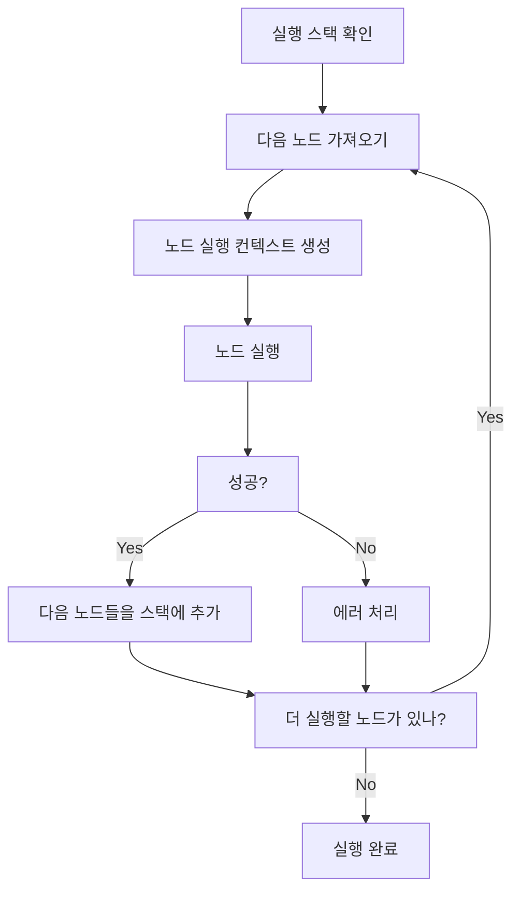
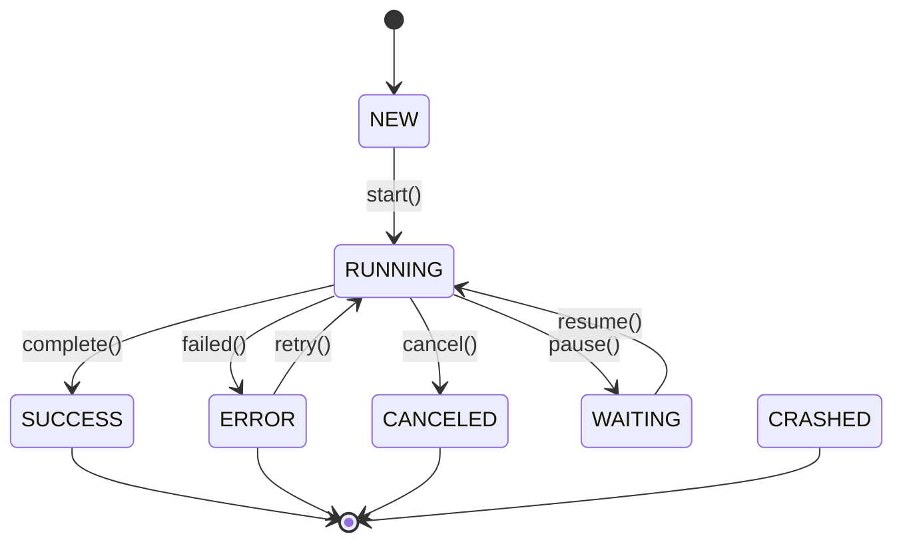

# 워크플로우 실행 엔진

n8n의 워크플로우 실행 엔진은 `packages/core`에 위치하며, 복잡한 워크플로우를 안정적으로 실행하는 핵심 시스템입니다. 이 문서는 실행 엔진의 아키텍처와 동작 원리를 상세히 설명합니다.

## 개요

워크플로우 실행 엔진은 다음과 같은 핵심 기능을 제공합니다:

- 노드 순서 결정 및 실행
- 데이터 흐름 관리
- 에러 처리 및 재시도
- 병렬/순차 실행 제어
- 트리거 및 폴링 관리

## 핵심 컴포넌트

### 1. WorkflowExecute

메인 실행 클래스로 전체 워크플로우 실행을 관리합니다.

```typescript
export class WorkflowExecute {
  private status: ExecutionStatus = 'new';
  private readonly abortController = new AbortController();

  constructor(
    private readonly additionalData: IWorkflowExecuteAdditionalData,
    private readonly mode: WorkflowExecuteMode,
    private runExecutionData: IRunExecutionData = createRunExecutionData(),
  ) {}

  // 워크플로우 실행 메소드
  run(
    workflow: Workflow,
    startNode?: INode,
    destinationNode?: IDestinationNode,
    pinData?: IPinData,
  ): PCancelable<IRun> {
    this.status = 'running';

    // 실행 로직 구현
    // ...
  }
}
```

### 2. ExecuteContext

개별 노드 실행 컨텍스트를 관리합니다.

```typescript
export class ExecuteContext {
  constructor(
    private readonly node: INode,
    private readonly workflowExecution: IWorkflowExecution,
    private readonly inputData: INodeExecutionData[],
    private readonly additionalData: IWorkflowExecuteAdditionalData,
  ) {}

  // 노드 실행
  async execute(): Promise<IRunNodeResponse> {
    // 노드 타입에 따른 실행 분기
    // ...
  }

  // 입력 데이터 처리
  getInputData(): INodeExecutionData[] {
    return this.inputData;
  }

  // 출력 데이터 설정
  setOutputData(data: INodeExecutionData[]): void {
    // ...
  }
}
```

## 실행 흐름

### 1. 초기화 단계



```typescript
// WorkflowExecute.run() 메소드
run(workflow: Workflow, startNode?: INode): PCancelable<IRun> {
  this.status = 'running';

  // 시작 노드 결정
  startNode = startNode || workflow.getStartNode();

  if (startNode === undefined) {
    throw new ApplicationError('No start node found');
  }

  // 노드 실행 스택 초기화
  const nodeExecutionStack: IExecuteData[] = [
    {
      node: startNode,
      data: { main: [[{ json: {} }]] },
      source: null,
    },
  ];

  // 실행 프로세스 시작
  return this.processExecution(workflow, nodeExecutionStack);
}
```

### 2. 실행 단계



### 3. 노드 실행 프로세스

```typescript
private async executeNode(executeData: IExecuteData): Promise<IRunNodeResponse> {
  const context = new ExecuteContext(
    executeData.node,
    this,
    executeData.data,
    this.additionalData
  );

  try {
    // 노드 타입에 따른 실행
    const nodeType = this.getNodeType(executeData.node.type);
    const result = await nodeType.execute.call(context);

    // 실행 결과 처리
    return {
      node: executeData.node,
      data: result.data,
      source: executeData.source,
    };
  } catch (error) {
    // 에러 처리 및 롤백
    await this.handleExecutionError(executeData.node, error);
    throw error;
  }
}
```

## 데이터 흐름 관리

### 1. 연결 타입

```typescript
// 노드 간 연결 정의
interface IConnection {
  node: string;
  type: NodeConnectionTypes;
  index: number;
}

export enum NodeConnectionTypes {
  main = 'main',        // 기본 데이터 흐름
  ai_agent = 'ai_agent', // AI 에이전트
  ai_tool = 'ai_tool',   // AI 툴
}
```

### 2. 데이터 매핑

```typescript
// 입력 데이터 매핑
private mapInputData(
  node: INode,
  sourceData: IRunData,
  connectionType: string = 'main'
): INodeExecutionData[] {
  const connections = node.connections?.[connectionType] || [];

  for (const connection of connections) {
    const sourceNode = connection.node;
    const sourceOutputIndex = connection.index || 0;

    // 소스 노드의 출력 데이터 가져오기
    const sourceRunData = sourceData[sourceNode];
    if (sourceRunData?.data?.[sourceOutputIndex]) {
      return sourceRunData.data[sourceOutputIndex];
    }
  }

  return [];
}
```

### 3. 데이터 변환

```typescript
// 데이터 변환 유틸리티
export class DataTransformer {
  static transform(items: INodeExecutionData[], mapping: IDataMapping): INodeExecutionData[] {
    return items.map(item => {
      // JSONPath를 이용한 필드 매핑
      const transformed = applyMapping(item.json, mapping);

      return {
        json: transformed,
        binary: item.binary,
        pairedItem: item.pairedItem,
      };
    });
  }
}
```

## 에러 처리

### 1. 에러 타입

```typescript
// 커스텀 에러 클래스
export class NodeOperationError extends Error {
  constructor(
    message: string,
    private readonly node: INode,
    private readonly runIndex: number = 0
  ) {
    super(message);
    this.name = 'NodeOperationError';
  }
}

export class WorkflowExecutionError extends Error {
  constructor(
    message: string,
    private readonly executionId: string,
    private readonly workflowId: string
  ) {
    super(message);
    this.name = 'WorkflowExecutionError';
  }
}
```

### 2. 에러 처리 전략

```typescript
private async handleExecutionError(
  node: INode,
  error: Error,
  executionData: IRunExecutionData
): Promise<void> {
  // 에러 기록
  this.recordError(node, error);

  // 에러 타입에 따른 처리
  switch (true) {
    case error instanceof NodeOperationError:
      await this.handleNodeError(node as INode, error, executionData);
      break;

    case error instanceof TimeoutError:
      await this.handleTimeoutError(node, error, executionData);
      break;

    default:
      await this.handleUnexpectedError(node, error, executionData);
  }
}
```

### 3. 실패 워크플로우 처리

```typescript
// 실패 시 실행 경로
private configureFailurePath(node: INode, error: Error): IExecuteData | null {
  const failureConnections = node.connections?.main?.filter(
    conn => conn.some(c => c.type === 'failure')
  );

  if (failureConnections && failureConnections.length > 0) {
    return {
      node: this.getNodeById(failureConnections[0].node),
      data: {
        main: [[{
          json: {
            error: error.message,
            node: node.name,
            timestamp: new Date().toISOString()
          }
        }]]
      },
      source: node,
    };
  }

  return null;
}
```

## 제어 흐름

### 1. 조건부 실행

```typescript
// 조건 노드 실행
private async executeIfNode(node: INode, input: INodeExecutionData[]): Promise<INodeExecutionData[]> {
  const conditions = node.parameters.conditions as ICondition[];
  const results: INodeExecutionData[] = [];

  for (const item of input) {
    const matchesConditions = conditions.every(condition =>
      this.evaluateCondition(condition, item.json)
    );

    if (matchesConditions) {
      results.push(item);
    }
  }

  return results;
}

private evaluateCondition(condition: ICondition, data: IDataObject): boolean {
  // 조건 평가 로직
  const leftValue = this.extractValue(condition.left, data);
  const rightValue = this.extractValue(condition.right, data);

  switch (condition.operation) {
    case 'equal': return leftValue === rightValue;
    case 'notEqual': return leftValue !== rightValue;
    case 'greater': return leftValue > rightValue;
    // ... 기타 조건 연산
  }
}
```

### 2. 반복 실행

```typescript
// 반복 노드 실행
private async executeLoopNode(node: INode, input: INodeExecutionData[]): Promise<INodeExecutionData[]> {
  const loopConfig = node.parameters.loop as ILoopConfig;
  const results: INodeExecutionData[][] = [];

  for (let i = 0; i < loopConfig.iterations; i++) {
    // 반복 데이터 생성
    const loopData = input.map(item => ({
      ...item,
      json: {
        ...item.json,
        $index: i,
        $iteration: i + 1
      }
    }));

    // 하위 노드 실행
    const childResults = await this.executeChildNodes(node, loopData);
    results.push(childResults);
  }

  return results.flat();
}
```

### 3. 병렬 실행

```typescript
// 분기 노드 실행
private async executeSplitNode(node: INode, input: INodeExecutionData[]): Promise<INodeExecutionData[]> {
  const branches = node.parameters.branches as IBranch[];

  // 모든 분기를 병렬로 실행
  const branchPromises = branches.map(async branch => {
    const branchData = this.filterDataForBranch(input, branch);
    return this.executeChildNodes(node, branchData);
  });

  const branchResults = await Promise.allSettled(branchPromises);

  // 성공한 결과만 병합
  return branchResults
    .filter(result => result.status === 'fulfilled')
    .flatMap(result => (result as PromiseFulfilledResult<INodeExecutionData[]>).value);
}
```

## 태스크 스케줄링

### 1. 실행 큐

```typescript
export class ExecutionQueue {
  private queue: Queue.IQueue;
  private runningExecutions = new Map<string, Execution>();

  constructor(
    private readonly redis: Redis,
    private readonly maxConcurrency: number = 10
  ) {
    this.queue = new Queue('workflow-executions', {
      redis,
      defaultJobOptions: {
        removeOnComplete: 100,
        removeOnFail: 50,
        attempts: 3,
        backoff: ' exponential',
      }
    });
  }

  async scheduleExecution(workflow: Workflow, data?: any): Promise<string> {
    const job = await this.queue.add('execute', {
      workflowId: workflow.id,
      data,
      timestamp: new Date().toISOString()
    });

    return job.id.toString();
  }
}
```

### 2. 동시성 제어

```typescript
export class ConcurrencyManager {
  private readonly runningCount = new Map<string, number>();
  private readonly semaphore = new Map<string, Semaphore>();

  async acquire(workflowId: string, maxConcurrency: number = 1): Promise<void> {
    if (!this.semaphore.has(workflowId)) {
      this.semaphore.set(workflowId, new Semaphore(maxConcurrency));
    }

    const sem = this.semaphore.get(workflowId)!;
    await sem.acquire();
  }

  release(workflowId: string): void {
    const sem = this.semaphore.get(workflowId);
    if (sem) {
      sem.release();
    }
  }
}
```

## 상태 관리

### 1. 실행 상태

```typescript
export enum ExecutionStatus {
  NEW = 'new',
  RUNNING = 'running',
  SUCCESS = 'success',
  ERROR = 'error',
  CANCELED = 'canceled',
  CRASHED = 'crashed',
  WAITING = 'waiting',
  RUNNING_RETRY = 'running_retry'
}

interface IExecutionStatus {
  id: string;
  status: ExecutionStatus;
  startedAt: Date;
  finishedAt?: Date;
  mode: WorkflowExecuteMode;
  nodeExecutionStack: IExecuteData[];
  data: IRunData;
}
```

### 2. 상태 전환



## 트리거 및 폴링

### 1. 트리거 관리

```typescript
export class TriggersAndPollers {
  private readonly activeTriggers = new Map<string, TriggerInstance>();

  async registerTrigger(workflow: Workflow, node: INode): Promise<void> {
    const triggerKey = `${workflow.id}:${node.id}`;

    const trigger = new TriggerInstance(node, workflow);
    this.activeTriggers.set(triggerKey, trigger);

    // 웹훅 트리거 설정
    if (node.type.startsWith('n8n-nodes-base.webhook')) {
      await this.setupWebhook(trigger);
    }
    // 폴링 트리거 설정
    else if (node.type.includes('poll')) {
      await this.setupPolling(trigger);
    }
  }

  async setupPolling(trigger: TriggerInstance): Promise<void> {
    const interval = setInterval(async () => {
      try {
        const data = await trigger.execute();
        if (data?.length > 0) {
          // 워크플로우 실행 트리거
          await this.triggerWorkflow(trigger, data);
        }
      } catch (error) {
        console.error('Polling error:', error);
      }
    }, trigger.getInterval());

    trigger.setInterval(interval);
  }
}
```

## 성능 최적화

### 1. 실행 최적화

```typescript
export class ExecutionOptimizer {
  // 노드 실행 병렬화
  optimizeExecutionPlan(workflow: Workflow): Graph {
    const graph = this.buildExecutionGraph(workflow);

    // 독립적인 노드들을 병렬 실행 가능한 그룹으로 묶기
    const parallelGroups = this.findParallelGroups(graph);

    return this.createOptimizedGraph(parallelGroups);
  }

  // 데이터 전송 최소화
  optimizeDataFlow(node: INode, data: INodeExecutionData[]): INodeExecutionData[] {
    // 사용되는 필드만 남기고 나머지 제거
    const requiredFields = this.getRequiredFields(node);

    return data.map(item => ({
      ...item,
      json: this.filterJson(item.json, requiredFields)
    }));
  }
}
```

### 2. 메모리 관리

```typescript
export class MemoryManager {
  private readonly memoryThreshold = 0.8; // 80%

  async checkMemoryUsage(): Promise<void> {
    const usage = process.memoryUsage();
    const threshold = this.memoryThreshold * this.maxMemory;

    if (usage.heapUsed > threshold) {
      // 메모리 정리 실행
      await this.cleanup();

      // 가비지 컬렉션 강제 실행
      if (global.gc) {
        global.gc();
      }
    }
  }

  private async cleanup(): Promise<void> {
    // 오래된 실행 데이터 정리
    const oldExecutions = await this.findOldExecutions();
    await this.deleteExecutions(oldExecutions);

    // 캐시 정리
    await this.clearCache();
  }
}
```

## 모니터링 및 로깅

### 1. 실행 로깅

```typescript
export class ExecutionLogger {
  private readonly logger = createLogger('workflow-execution');

  logExecutionStart(executionId: string, workflow: Workflow): void {
    this.logger.info('Execution started', {
      executionId,
      workflowId: workflow.id,
      workflowName: workflow.name,
      timestamp: new Date().toISOString(),
    });
  }

  logNodeExecution(
    executionId: string,
    nodeId: string,
    status: 'start' | 'success' | 'error',
    duration?: number
  ): void {
    this.logger.info('Node execution', {
      executionId,
      nodeId,
      status,
      duration,
      timestamp: new Date().toISOString(),
    });
  }
}
```

### 2. 메트릭 수집

```typescript
export class MetricsCollector {
  private readonly metrics = new Map<string, number>();

  recordExecutionTime(workflowId: string, duration: number): void {
    const key = `workflow:${workflowId}:execution_time`;
    this.recordMetric(key, duration);
  }

  recordNodeExecutionTime(nodeType: string, duration: number): void {
    const key = `node:${nodeType}:execution_time`;
    this.recordMetric(key, duration);
  }

  getAverageWorkflowTime(workflowId: string): number {
    const key = `workflow:${workflowId}:execution_time`;
    const values = this.getMetricValues(key);
    return values.length > 0 ? values.reduce((a, b) => a + b, 0) / values.length : 0;
  }
}
```

## 모범 사례

1. **실행 설계**
   - 순환 참조 방지
   - 적절한 제한 및 타임아웃 설정
   - 에러 경로 설계

2. **성능**
   - 불필요한 데이터 전송 최소화
   - 병렬 실행 지점 식별
   - 메모리 사용량 모니터링

3. **안정성**
   - 전체 롤백 메커니즘
   - 재시도 정책 설정
   - 장애 조치 계획

4. **디버깅**
   - 상세한 실행 로그
   - 메트릭 수집
   - 상태 추적